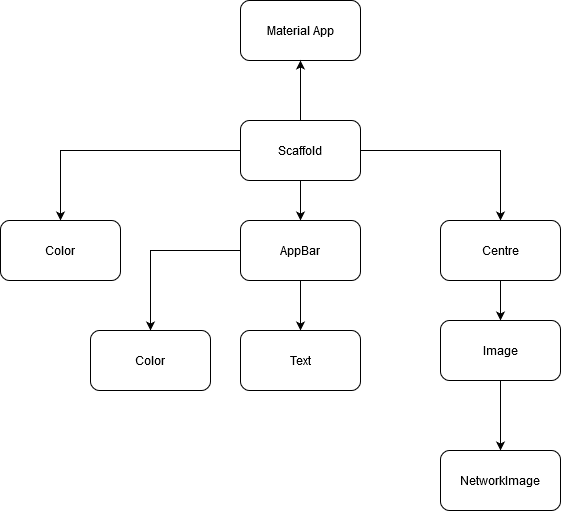

<h1>basic_dev</h1>

**Flutter application for learing and implementing**

## Lession 1 - Scaffold and Loading Network Image
- Scaffold
- Network Image Loading
- Working with Assets and pubspec.yaml
- **Flowchart:** 

- **App Snap:**

